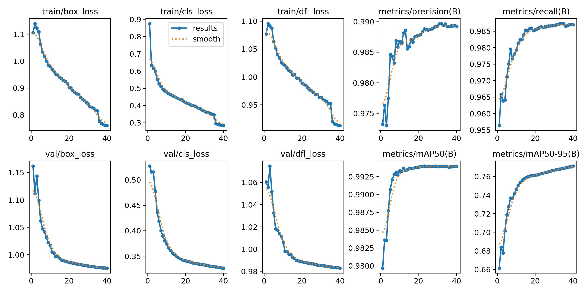
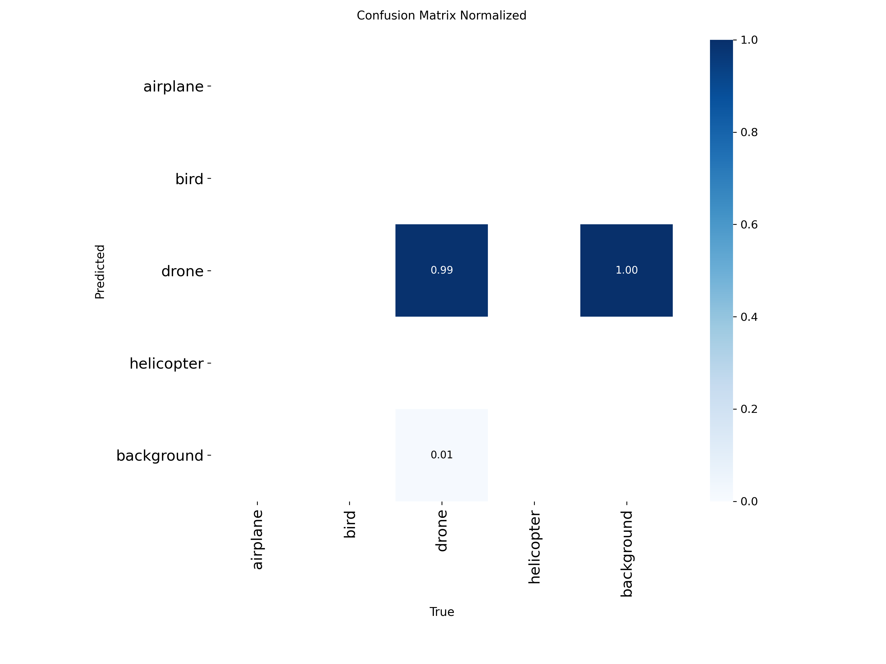
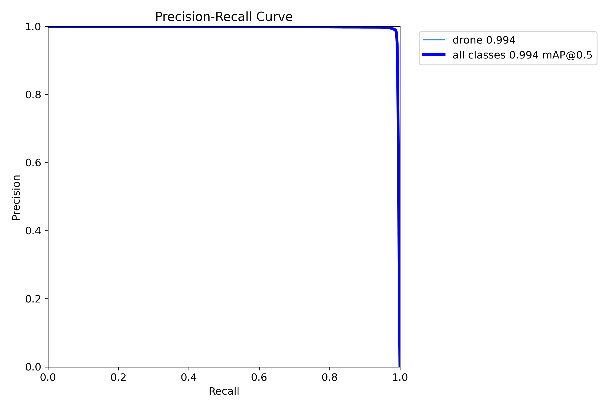
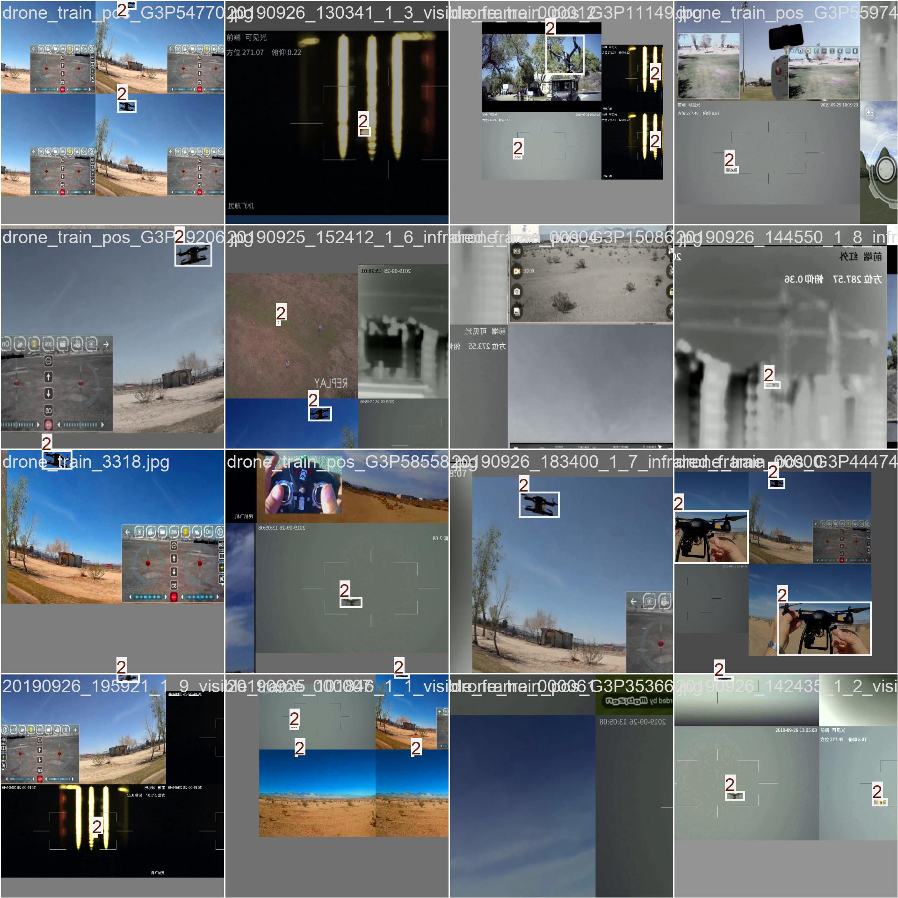
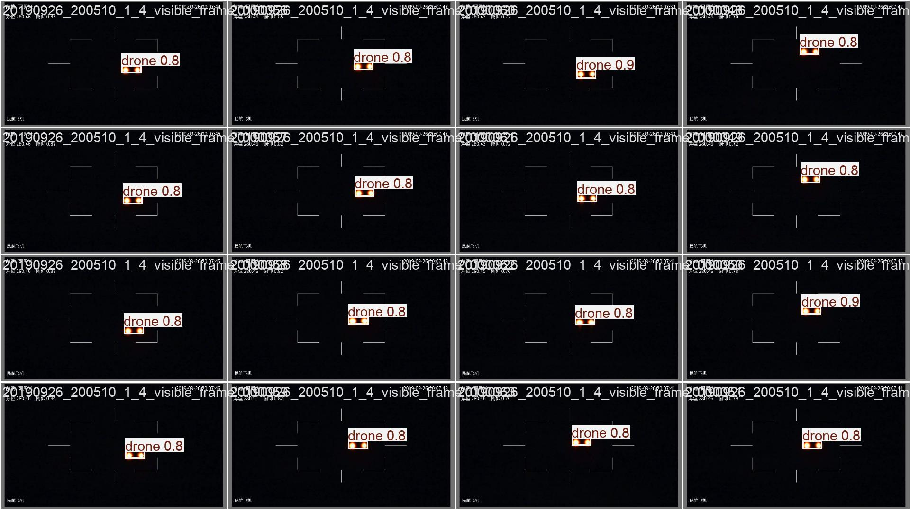

# 🚁 UAV-YOLOv11m Drone Detection & Tracking System

[](https://www.python.org/downloads/)
[](https://github.com/ultralytics/ultralytics)


## 🌟 Features

- **High-Performance Detection**: Fine-tuned YOLOv11m model specifically for UAV/drone detection
- **Advanced Tracking**: BoTSORT algorithm with camera motion compensation
- **Real-time Processing**: Support for live camera feeds and video files
- **Web Interface**: User-friendly Streamlit application
- **Multiple Input Sources**: Camera, video files, and image processing
- **GPU Acceleration**: CUDA support for enhanced performance

## 📊 Model Performance

The model was trained on a comprehensive UAV dataset using RunPod's NVIDIA GeForce RTX 5090:

| Metric | Value |
|--------|-------|
| **mAP50** | 99.4% |
| **mAP50-95** | 77.1% |
| **Precision** | 98.9% |
| **Recall** | 98.7% |
| **Training Time** | 5.63 hours |
| **Epochs** | 40 |
| **Image Size** | 768x768 |

### Training Configuration
- **GPU**: NVIDIA GeForce RTX 5090 (32GB)
- **Batch Size**: 36 (auto-calculated)
- **Dataset**: 63,197 training images, 15,683 validation images
- **Classes**: 4 (drone types)
- **Framework**: Ultralytics 8.3.160, PyTorch 2.8.0

## 📈 Training Results

### Performance Curves


### Confusion Matrix


### PR Curve


### Sample Predictions
<table>
<tr>
<td></td>
<td></td>
</tr>
<tr>
<td align="center">Train Batch 0</td>
<td align="center">Validation Batch 1</td>
</tr>
</table>

## 🚀 Quick Start

### Prerequisites
```bash
# Python 3.8 or higher required
python --version

# Install dependencies
pip install -r requirements.txt
```

### Installation

1. Clone the repository:
```bash
git clone https://github.com/enestasyurek/UAV-Detection.git
cd UAV-Detection
```

2. Install required packages:
```bash
pip install -r requirements.txt
```

## 💻 Usage

### Web Interface (Recommended)

Launch the Streamlit web application:

```bash
# Using the run script
./run.sh

# Or directly
streamlit run app.py
```

Open your browser and navigate to: `http://localhost:8501`

#### Features:
- 📹 **Live Camera**: Real-time drone detection from webcam
- 📁 **Video Upload**: Process and download tracked videos
- ⚙️ **Adjustable Settings**: Model selection and confidence threshold
- 📊 **Performance Metrics**: FPS and detection statistics


## ⚙️ BoTSORT Configuration

The tracker uses optimized BoTSORT parameters for drone tracking:

```yaml
tracker_type: botsort
track_high_thresh: 0.5    # First association threshold
track_low_thresh: 0.1     # Second association threshold
new_track_thresh: 0.6     # New track initialization
track_buffer: 30          # Frames before track removal
match_thresh: 0.8         # Matching threshold
cmc_method: sparseOptFlow # Camera motion compensation
fuse_score: true          # Score fusion enabled
```

## 🔧 Advanced Configuration

### Camera Selection
If you have multiple cameras, you can select different indices (0, 1, 2) in the web interface.

### Model Options
- `UAV-YOLOv11m.pt`: Fine-tuned for drone detection (recommended)
- `yolov8n.pt` to `yolov8x.pt`: General object detection models

### Performance Tuning
- Adjust confidence threshold (0.0-1.0) for detection sensitivity
- Lower values detect more objects but may include false positives
- Higher values are more selective but may miss some detections

## 📋 Requirements

```
streamlit>=1.28.0
ultralytics>=8.0.0
opencv-python>=4.8.0
numpy>=1.24.0
Pillow>=10.0.0
torch>=2.0.0
torchvision>=0.15.0
scipy>=1.10.0
```

## 🐛 Troubleshooting

### Camera Issues
- Ensure camera permissions are granted
- Try different camera indices (0, 1, 2)
- Close other applications using the camera
- Check Windows Settings > Privacy > Camera

### GPU Support
- Install CUDA-enabled PyTorch for GPU acceleration
- Check GPU availability with `torch.cuda.is_available()`


## 🙏 Acknowledgments

- [Ultralytics](https://github.com/ultralytics/ultralytics) for YOLOv11
- [BoTSORT](https://github.com/NirAharon/BoT-SORT) for the tracking algorithm
- [RunPod](https://www.runpod.io/) for GPU infrastructure
- [Streamlit](https://streamlit.io/) for the web framework
